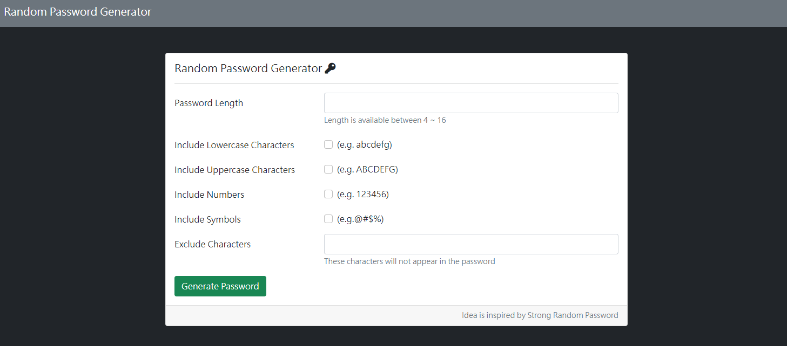
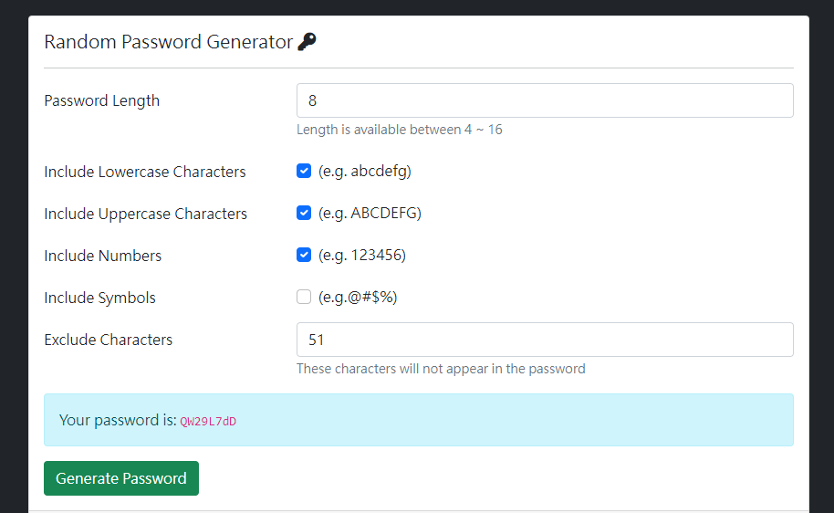

# 隨機密碼產生器 Random Password Generator - 簡介

可以產生一組4-16個長度的隨機密碼





## 功能列表

- 可以選擇密碼長度為4-16位數，並依據勾選的條件(英文大寫、小寫、數字、符號)以及排除的條件，產生隨機密碼。

### 安裝與執行步驟

1. 請先確認有安裝 node.js 與 npm
2. 將專案 clone 到本地
3. 在本地開啟之後，透過終端機進入資料夾，輸入：

   ```
   npm install  //安裝套件
   ```

4. 安裝完畢後，繼續輸入：

   ```
   npm run start  //執行程式
   ```

5. 若看見此行訊息則代表順利運行，打開瀏覽器進入到以下網址

   ```
   Listening on http://localhost:3000
   ```

6. 結束使用

   ```
   ctrl + c  //結束程式
   ```

### 開發工具

- [Visual Studio Code](https://visualstudio.microsoft.com/zh-hant/) 
- [Node.js](https://nodejs.org/en/)
- [Express 4.16.4](https://www.npmjs.com/package/express) -
- [Express-Handlebars 3.0.0](https://www.npmjs.com/package/express-handlebars)
- [Bootstrap 5.1.3](https://getbootstrap.com/)
- [Font-awesome 5.6.3](https://fontawesome.com/)